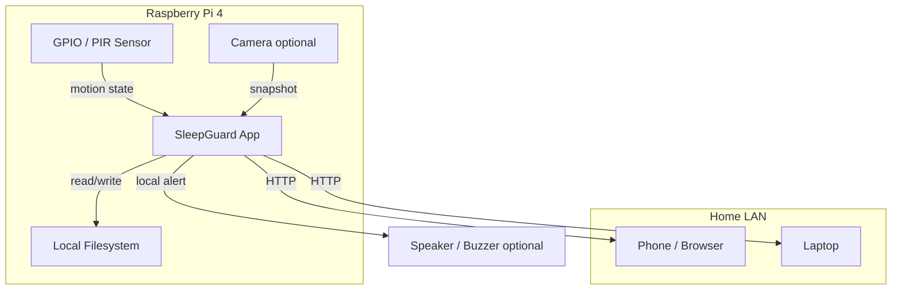
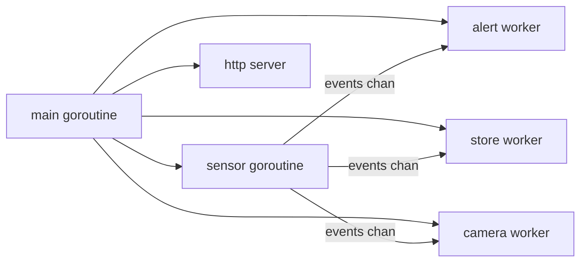

# SleepGuard Architecture

This document describes the high-level design (HLD) and low-level design (LLD) for SleepGuard — a local-first motion monitoring system on Raspberry Pi 4.

---

## 1. High-Level Design (HLD)

### 1.1 System context

SleepGuard runs entirely on a Raspberry Pi 4 on the home LAN. It reads a PIR motion sensor, processes events locally, triggers alerts, persists history, and serves a web dashboard. No internet or cloud is required for the MVP.



### 1.2 Design principles

| Principle | Decision |
|-----------|----------|
| Local-first | All core logic runs on the Pi; no external API for MVP |
| Motion before camera | PIR alerting is the primary signal; camera is additive |
| Interface boundaries | Hardware, storage, and alerts behind Go interfaces |
| Event-driven | Sensor produces events; workers consume via channels |
| Fail safe | Sensor errors are logged; app keeps running where possible |
| Observable | Structured logs + `/health`, `/status`, telemetry endpoints |

### 1.3 Major components

```text
┌─────────────────────────────────────────────────────────────┐
│                      cmd/sleepguard                          │
│  main: parse config → wire deps → start workers → shutdown  │
└─────────────────────────────────────────────────────────────┘
         │              │              │              │
         ▼              ▼              ▼              ▼
   ┌──────────┐  ┌──────────┐  ┌──────────┐  ┌──────────────┐
   │  config  │  │  sensor  │  │  alert   │  │     web      │
   └──────────┘  └──────────┘  └──────────┘  └──────────────┘
         │              │              │              │
         │              ▼              ▼              ▼
         │         ┌──────────┐  ┌──────────┐  ┌──────────────┐
         │         │  store   │  │telemetry │  │   camera   │
         │         └──────────┘  └──────────┘  └──────────────┘
         │              │
         └──────────────┴── shared types, slog logger
```

### 1.4 Data flow (steady state)

1. **Sensor poller** reads GPIO pin state on an interval.
2. On state change (or cooldown expiry), a **MotionEvent** is published to an event channel.
3. **Alert worker** receives the event, runs the alert state machine, and triggers the configured channel.
4. **Store worker** appends the event to in-memory ring buffer and persistent log (JSONL / SQLite).
5. **Telemetry** increments counters (motion count, alert count, etc.).
6. **Web server** serves dashboard and JSON API from the store and telemetry.
7. **Camera worker** (phase 4) captures a snapshot on motion and links it to the event.

### 1.5 Deployment view

| Environment | Role |
|-------------|------|
| Dev machine (Windows/Mac/Linux) | Edit code, unit logic, cross-compile |
| Raspberry Pi 4 | Production runtime, GPIO, camera, LAN dashboard |
| Docker (optional) | Repeatable packaging; GPIO may need `--device` flags |

### 1.6 Non-functional requirements

| Requirement | Target |
|-------------|--------|
| Alert latency | &lt; 2 s from motion to alert (local) |
| Dashboard | Accessible on LAN without auth (MVP) |
| Uptime | Survives sensor read errors; graceful restart |
| Storage | Last N events in memory; full history on disk |
| Cooldown | Configurable; prevents alert spam |

---

## 2. Low-Level Design (LLD)

### 2.1 Package responsibilities

#### `internal/config`

Loads runtime configuration from flags, environment variables, and optional config file.

```go
type Config struct {
    DeviceName     string
    HTTPAddr       string        // e.g. ":8080"
    AlertCooldown  time.Duration
    Debug          bool
    GPIO_Pin       string        // e.g. "GPIO17"
    PollInterval   time.Duration
    StorePath      string        // JSONL or SQLite path
    CameraEnabled  bool
    SnapshotDir    string
}
```

#### `internal/sensor`

Abstracts hardware behind an interface so `main` and tests do not depend on GPIO directly.

```go
type Reader interface {
    Read(ctx context.Context) (<-chan Event, error)
    Close() error
}

type Event struct {
    Timestamp time.Time
    Type      string // "motion"
    Source    string // device name or "pir"
    State     string // "active" | "idle"
}
```

**Implementations:**

| Type | Use |
|------|-----|
| `PIRReader` | Real GPIO via `periph.io` on Pi |
| `MockReader` | Dev machine / tests |

**Polling logic (PIRReader):**

- Poll pin every `PollInterval` (e.g. 200 ms).
- Compare with previous state.
- Emit event only on transition `idle → active` or after `AlertCooldown` since last alert.
- Log skipped events during cooldown at debug level.

#### `internal/alert`

State machine and alert dispatch.

```go
type State int
const (
    StateIdle State = iota
    StateMotionDetected
    StateCooldown
    StateAlertSent
)

type Notifier interface {
    Notify(ctx context.Context, event sensor.Event) error
}
```

**Phase 1 notifier options (pick one first):**

- `ExecNotifier` — run a local shell command (e.g. `aplay` beep)
- `LogNotifier` — loud structured log (dev fallback)
- `HTTPNotifier` — POST to a local webhook (future)

State transitions:

```text
idle ──(motion)──► motion_detected ──(notify ok)──► alert_sent ──(cooldown)──► cooldown ──(timer)──► idle
```

#### `internal/store`

Thread-safe event storage.

```go
type Store interface {
    Append(ctx context.Context, event sensor.Event) error
    Recent(limit int) []sensor.Event
    Load() error   // hydrate from disk on startup
    Close() error
}
```

**Implementations:**

| Type | Phase | Notes |
|------|-------|-------|
| `MemoryStore` | 2 | Ring buffer, `sync.RWMutex` |
| `JSONLStore` | 3 | Append-only file, one JSON object per line |
| `SQLiteStore` | 3 optional | If structured queries are needed |

#### `internal/web`

HTTP server and handlers.

| Route | Method | Response |
|-------|--------|----------|
| `/health` | GET | `200 OK`, minimal JSON |
| `/status` | GET | Device name, uptime, last event, state |
| `/events` | GET | Recent events as JSON array |
| `/events` | GET `?limit=N` | Paginated recent events |
| `/config` | GET | Non-secret runtime config |
| `/` | GET | HTML dashboard (recent events table) |
| `/metrics` | GET | Telemetry counters (phase 4) |
| `/snapshot/latest` | GET | Latest JPEG (phase 4) |

Uses `http.ServeMux` (Go 1.22+ path patterns) or a small router. Templates in `internal/web/templates/`.

#### `internal/telemetry`

Counters exposed to web and optionally `/metrics`.

```go
type Metrics struct {
    MotionCount   atomic.Uint64
    AlertCount    atomic.Uint64
    FalseAlerts   atomic.Uint64  // manual or future tuning
    StartTime     time.Time
    LastEventTime atomic.Value   // time.Time
}
```

#### `internal/camera` (phase 4)

```go
type Capturer interface {
    Capture(ctx context.Context, destPath string) error
    LatestPath() string
}
```

Uses `libcamera-still` or `raspistill` via `os/exec` on Pi. Attaches `SnapshotPath` to event metadata in store.

### 2.2 Concurrency model (phase 3+)



| Goroutine | Responsibility |
|-----------|----------------|
| Main | Config, wiring, signal handling, `context` cancel |
| Sensor | GPIO poll loop, publish to `chan Event` |
| Alert | Consume events, state machine, call `Notifier` |
| Store | Consume events, append to memory + disk |
| HTTP | `ListenAndServe`, handlers read store/telemetry |
| Camera | On motion, capture JPEG, update latest path |

**Channels:**

- `events chan sensor.Event` — buffered (e.g. capacity 32).
- Shutdown: `context.Context` cancelled on SIGINT/SIGTERM; workers drain and exit.

### 2.3 Core types (domain model)

Migrate from `internals/helpers` to `internal/sensor` (or a shared `internal/domain` package if needed).

```go
type Event struct {
    ID           string    `json:"id,omitempty"`
    Timestamp    time.Time `json:"timestamp"`
    Type         string    `json:"type"`
    Source       string    `json:"source"`
    State        string    `json:"state"`
    SnapshotPath string    `json:"snapshot_path,omitempty"`
}
```

JSON serialization uses RFC3339 timestamps for API responses.

### 2.4 Configuration and startup sequence

```text
1. Parse flags / env → Config
2. Init slog (text or JSON handler based on Debug)
3. Construct Store (Load from disk)
4. Construct Sensor Reader (PIR or Mock)
5. Construct Notifier
6. Create context + cancel on signal
7. Start goroutines: sensor, alert, store, [camera]
8. Start HTTP server in goroutine
9. Block until context done
10. Shutdown HTTP (Shutdown with timeout)
11. Close sensor, flush store
```

### 2.5 Error handling strategy

| Layer | Behavior |
|-------|----------|
| GPIO read error | Log error, continue polling |
| Alert notify failure | Log error, still transition to cooldown to avoid spam |
| Store write failure | Log error, keep in-memory copy |
| HTTP handler error | Return 500 + log; do not crash server |
| Camera capture failure | Log error; event stored without snapshot |

### 2.6 Security (MVP)

- LAN-only binding (`:8080` on all interfaces).
- No authentication on dashboard (acceptable for home MVP; document as limitation).
- No secrets in repo; config via flags/env.
- Future: basic auth or mTLS if exposed beyond LAN.

### 2.7 Directory structure (target)

```text
sleepguard/
├── cmd/sleepguard/main.go
├── internal/
│   ├── config/config.go
│   ├── sensor/
│   │   ├── sensor.go      # interface + Event
│   │   ├── pir.go         # GPIO implementation
│   │   └── mock.go        # dev/test
│   ├── alert/
│   │   ├── alert.go       # state machine
│   │   └── notifier.go
│   ├── store/
│   │   ├── store.go
│   │   ├── memory.go
│   │   └── jsonl.go
│   ├── web/
│   │   ├── server.go
│   │   ├── handlers.go
│   │   └── templates/dashboard.html
│   ├── telemetry/metrics.go
│   └── camera/capture.go
├── docs/
├── Dockerfile
├── go.mod
└── README.md
```

### 2.8 External dependencies

| Package | Purpose |
|---------|---------|
| `periph.io/x/host/v3` | Pi host init |
| `periph.io/x/conn/v3/gpio` | GPIO pin read |
| `database/sql` + SQLite driver | Optional phase 3 |
| `github.com/prometheus/client_golang` | Optional phase 4 metrics |

### 2.9 Testing strategy

| Layer | Approach |
|-------|----------|
| Sensor | `MockReader` injects timed events |
| Store | Unit tests for append/recent/load |
| Alert | State machine transition tests |
| Web | `httptest` for `/health`, `/events` |
| Integration | Manual on Pi per checklist |

---

## 3. Evolution path

```text
MVP (phases 1–4)
    → MQTT or webhook to phone (optional)
    → Cloud sync (multi-device)
    → Prometheus + Grafana
    → Kubernetes (only if multiple services)
    → AI vision on snapshots
```

Each layer stays behind interfaces so the core pipeline does not need rewrites.

---

## 4. Related documents

- [implementation-plan.md](implementation-plan.md) — build phases and deliverables
- [checklist.md](checklist.md) — Pi 4 tasks per phase
- [electronics.md](electronics.md) — wiring and parts
